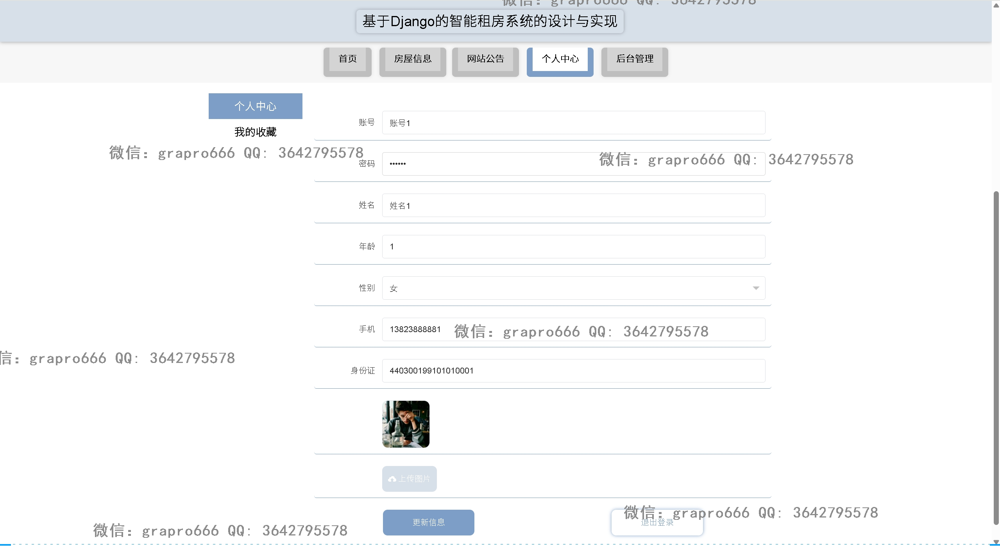
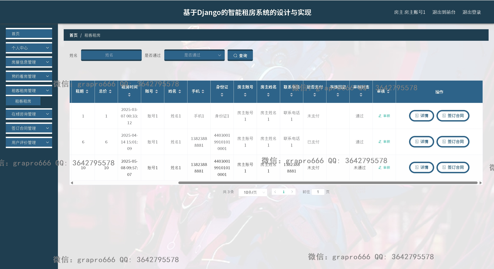

## 本项目完整源码是收费的  接毕业设计和论文

### 作者微信：grapro666 QQ：3642795578 (支持部署调试、支持代做毕设)

### 接javaweb、python、小程序、H5、APP、各种管理系统、单片机、嵌入式等开发

### 选题+开题报告+任务书+程序定制+安装调试+论文+答辩ppt

**博客地址：
[https://blog.csdn.net/2303_76227485/article/details/147815865](https://blog.csdn.net/2303_76227485/article/details/147815865)**

**视频演示：
[https://www.bilibili.com/video/BV1gU5GzuEwe/](https://www.bilibili.com/video/BV1gU5GzuEwe/)**

**毕业设计所有选题地址：
[https://github.com/codegitpro/allProject](https://github.com/codegitpro/allProject)**

## 基于python+Django+vue的房屋租赁系统(源代码+数据库+万字论文)219
## 一、系统介绍
本项目前后端分离，分为租客、房东、管理员三种角色
### 1、租客：
- 注册、登录、公告、房源信息、预约看房、租房、在线咨询、合同签订、评价、房租支付、个人信息、密码修改、我的收藏
### 2、房东：
- 注册、登录、房源管理、预约看房管理、租房管理、租房合同管理、在线回复、评价管理、个人信息、密码修改
### 3、管理员：
- 包括房东所有功能、租客管理、房东管理、用户管理、房东管理、类型管理、轮播图管理、公告管理
## 二、所用技术
后端技术栈：
- python
- django
- Mysql

前端技术栈：
- Vue
- Vue-router
- axios
- elementPlus

## 三、环境介绍
基础环境 :IDEA/pycharm, python3.8, Mysql5.7及以上, node14, navicat

所有项目以及源代码本人均调试运行无问题 可支持远程调试运行

## 四、页面截图
文档截图:

### 1、用户：

### 2、房东：

### 3、管理员：

   

## 五、浏览地址
前台地址：http://localhost:8080/houserentPython2/front/index.html

租客账号密码：账号1/123456

后台地址：http://localhost:8081

房主账户密码：房主账号1/123456

管理员账户密码：admin/admin

## 六、部署教程
1. 使用Navicat或者其它工具，在mysql中创建对应名称的数据库，并执行项目的sql文件

2. 使用IDEA/PyCharm导入houserentPython项目，File>setting>Project>Python interpreter配置虚拟环境

3. 修改config.ini里面的数据库配置

4. 打开CMD 然后执行cd F:\code\houserentPython
   注意此处的路径是我本地的，改成你自己电脑上的即可再执行python manage.py runserver 0.0.0.0:8000命令就启动后端了

5. vscode或idea打开houserentPython/templates/front/admin前端项目

6. 在编译器中打开terminal，执行npm install 依赖下载完成后执行 npm run serve,执行成功后会显示后台访问地址
